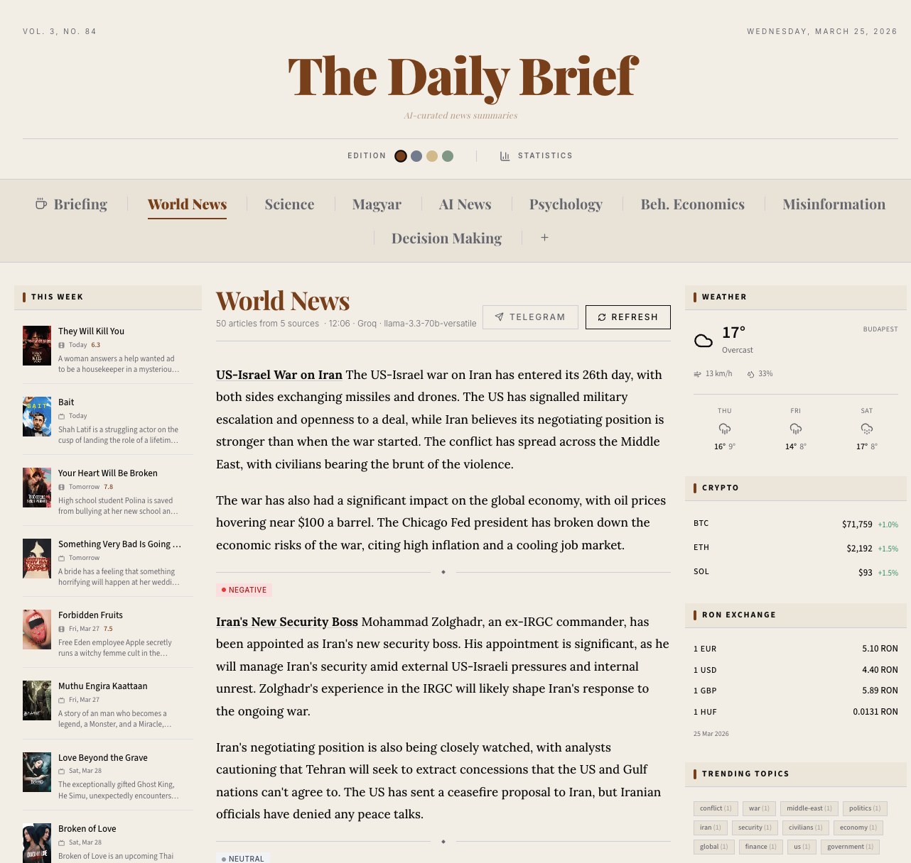

# News Digest

AI-powered news aggregation and summarization platform with a newspaper-inspired editorial UI. Fetches RSS feeds, summarizes them using LLM APIs, and presents everything in a clean, multi-column layout with real-time widgets.




## Features

**Core**
- RSS feed aggregation with AI-powered summarization
- Provider fallback system (Groq / Cerebras) with automatic failover
- Summary history with date-based archive navigation
- Article-level caching to minimize redundant API calls
- Sentiment analysis and topic extraction per article section

**Interactive**
- Chat with AI about any summary ("Ask about this news")
- Morning briefing — cross-category daily digest
- Feed auto-discovery — paste any URL to find RSS feeds
- Send summaries to Telegram with one click

**Widgets**
- Upcoming movies & TV shows (TMDB) with detail modals
- Hacker News top posts
- Weather forecast (Open-Meteo)
- Cryptocurrency prices (CoinGecko)
- RON exchange rates (Frankfurter)
- Trending topics from your feeds
- Headlines from configured sources

**Design**
- 4 newspaper color themes (Classic, Broadsheet, Evening, Morning)
- Three-column layout: left sidebar, main content, right sidebar
- Editorial typography: Playfair Display, Lora, Source Sans 3
- LLM usage statistics with live provider quota tracking

## Tech Stack

| Layer | Technology |
|-------|-----------|
| Frontend | React 19, TypeScript, Tailwind CSS 4, Vite |
| Backend | Express 5, better-sqlite3, rss-parser |
| AI | Groq (llama-3.3-70b), Cerebras (llama3.1-8b) |
| APIs | TMDB, CoinGecko, Open-Meteo, Frankfurter, Hacker News, Wikipedia |

## Getting Started

### Prerequisites

- Node.js 18+
- npm

### Installation

```bash
# Clone the repository
git clone https://github.com/elodlukacs/news-digest.git
cd news-digest

# Install server dependencies
cd server
npm install
cp .env.example .env
# Edit .env with your API keys (see Configuration below)

# Install client dependencies
cd ../client
npm install
```

### Configuration

Edit `server/.env` with your API keys:

```env
# Required — at least one LLM provider
GROQ_API_KEY=           # https://console.groq.com
CEREBRAS_API_KEY=       # https://cloud.cerebras.ai

# Optional
TELEGRAM_BOT_TOKEN=     # BotFather on Telegram
TELEGRAM_CHAT_ID=       # Your chat ID
TMDB_API_KEY=           # https://www.themoviedb.org/settings/api
```

### Running

Start both the server and client in separate terminals:

```bash
# Terminal 1 — Backend (port 3001)
cd server
node index.js

# Terminal 2 — Frontend (port 5173)
cd client
npm run dev
```

Open [http://localhost:5173](http://localhost:5173) in your browser.

## Usage

1. **Add categories** using the `+` button in the navigation bar (e.g., "World News", "Technology")
2. **Add RSS feeds** by right-clicking a category and selecting "Manage Sources"
3. **Click Refresh** to fetch and summarize the latest articles
4. **Browse history** using the Archive panel in the left sidebar
5. **Chat** about any summary using the chat panel below the article
6. **Send to Telegram** using the button next to the Refresh button

## Project Structure

```
news-digest/
├── client/                 # React frontend
│   ├── src/
│   │   ├── components/     # UI components
│   │   ├── hooks/          # Custom React hooks
│   │   ├── types/          # TypeScript interfaces
│   │   └── index.css       # Theme definitions
│   └── vite.config.ts
├── server/
│   ├── index.js            # Express API + all routes
│   ├── .env.example        # Environment template
│   └── package.json
└── package.json
```

## License

MIT
