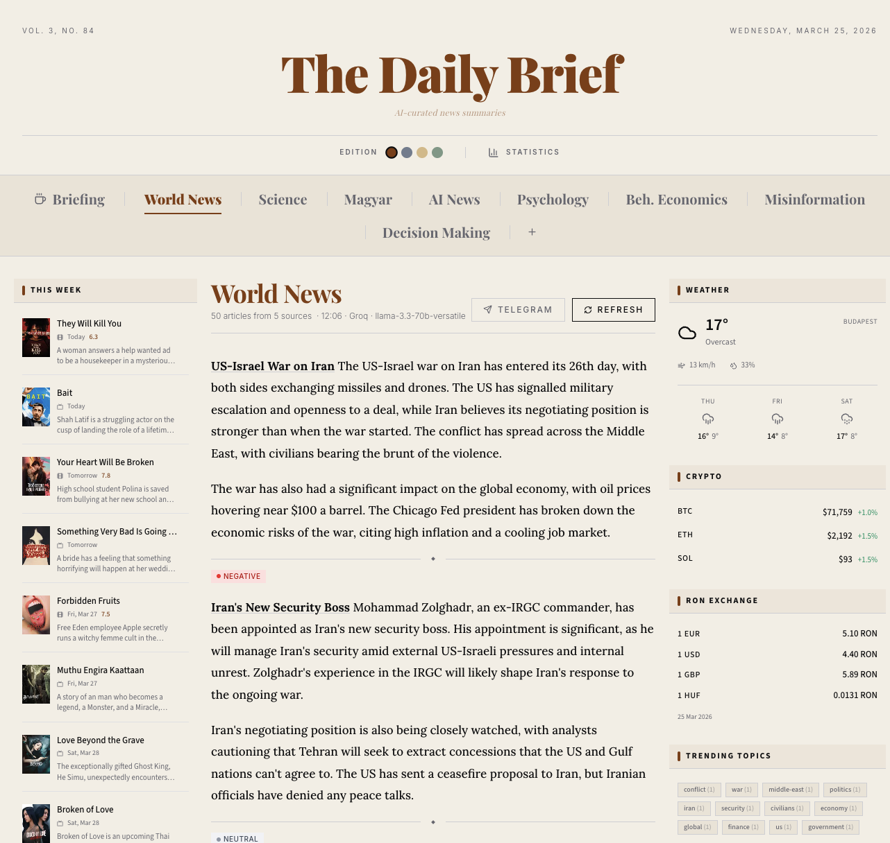

# News Digest

AI-powered news aggregation and summarization platform with a newspaper-inspired editorial UI. Fetches RSS feeds, summarizes them using LLM APIs, and presents everything in a clean, multi-column layout with real-time widgets.




## Features

### Core News

- RSS feed aggregation with AI-powered summarization
- Provider fallback system (Groq / OpenRouter) with automatic failover
- Summary history with date-based archive navigation
- Article-level caching to minimize redundant API calls
- Sentiment analysis and topic extraction per article section
- Feed auto-discovery — paste any URL to find RSS feeds
- Category-level custom prompts and language settings for LLM output

### Interactive

- Chat with AI about any summary ("Ask about this news")
- Morning briefing — cross-category daily digest
- Model selection — switch between Llama and MiniMax2.7
- Send summaries to Telegram with one click
- Pull-to-refresh on mobile

### Widgets

- Job board — aggregated from 12 sources (incl. direct Greenhouse/Lever/Ashby/Workable boards) with AI filtering driven by a configurable `JOB_PROFILE`
- Upcoming movies & TV shows (TMDB) with detail modals
- Hacker News top posts
- Weather forecast (Open-Meteo)
- Cryptocurrency prices (CoinGecko)
- RON exchange rates (Frankfurter)
- Trending topics from your feeds
- PBS Headlines

### MindGames — Cognitive Resilience Dashboard

Based on the "Mental Antibody" implementation spec and the "Engineering Cognitive Resilience" research paper. 57 features across 5 tabs:

**Overview** — Dashboard stats, quick actions, recent activity

**Training**
- **Inoculation Lab** (Van der Linden) — Build "mental antibodies" by identifying manipulation tactics in AI-generated headlines. Includes Detective Mode + CDO Mode with level progression, score tracking, and `useOptimistic` for instant feedback
- **Pattern Recognition Tests** — Interactive exercises demonstrating apophenia (seeing patterns that aren't there) using random data: coincidence, scatter, sequence, and correlation tests

**Analysis**
- **Cognitive Forensic Engine** (Grimes/Ariely) — Deconstruct text into logical and psychological components. Fallacy detection with 14 taxonomy types, emotional intensity mapping, Funnel of Misbelief visualization, SSE streaming, history viewer
- **Study Stress-Tester** — Evaluate news headlines about studies: sample size, control groups, conflicts of interest, peer review status
- **Compare Coverage** (Ground News style) — Multi-column Left/Center/Right outlet comparison with framing analysis and narrative divergence scoring
- **News Spectrum** — Side-by-side outlet credibility ratings and bias spectrum visualization

**Reflection**
- **Scientist's Sandbox** (Adam Grant) — ADEPT multi-agent debate (Skeptic, Institutionalist, Moralist), pre/post confidence tracking, thinking mode detection (Preacher/Prosecutor/Politician/Scientist), rethinking journal with trend charts
- **Bridge Builder** (Monica Guzman) — SOS Audit (Sorting/Othering/Siloing), "How" bridge-building questions, Schwartz Values Quiz, Information Diet echo-chamber diagram
- **Stress & Bias Diagnostic** — Pre-engagement emotional state check-in with motivated reasoning risk score

**Reference**
- **Prompt Library** — Searchable templates for bias detection, perspective taking, fallacy search, steelmanning, source evaluation
- **Narrative Map** — Misinformation spread visualization across platforms with timeline slider and mutation tracking
- **Disinfo Influencer Map** — Gateway (health/wellness) → Bridge (influencers) → Conspiracy Core funnel visualization
- **Daily Quiz** — Daily technique-guessing quiz bridging cognitive and bias-radar modules

**Bias Radar** — 5-tab slide-over panel used across the app (from article views and homepage): technique picker, compare, decode, steelman, timeline, diet report, gut check

### Design

- 4 newspaper color themes (Classic, Broadsheet, Evening, Morning)
- Three-column layout: left sidebar, main content, right sidebar
- Editorial typography: Playfair Display, Lora, Inter, Source Sans 3
- LLM usage statistics with live provider quota tracking
- 5-column newspaper grid homepage with article images
- Server-synced theme preference

## Tech Stack

| Layer | Technology |
|-------|-----------|
| Frontend | React 19, TypeScript, Tailwind CSS 4, Vite, ShadCN UI, Recharts |
| Backend | Express 5, better-sqlite3 (WAL mode), rss-parser |
| AI | Groq (openai/gpt-oss-20b), OpenRouter (minimax/minimax-m2.7) |
| APIs | TMDB, CoinGecko, Open-Meteo, Frankfurter, Hacker News, PBS |

## Getting Started

### Prerequisites

- Node.js 18+
- npm

### Installation

```bash
# Clone the repository
git clone https://github.com/elodlukacs/news-digest.git
cd news-digest

# Install server dependencies
cd server
npm install
cp .env.example .env
# Edit .env with your API keys (see Configuration below)

# Install client dependencies
cd ../client
npm install
```

### Configuration

Edit `server/.env` with your API keys:

```env
# Required — at least one LLM provider
GROQ_API_KEY=           # https://console.groq.com
OPENROUTER_API_KEY=     # https://openrouter.ai

# Optional
TELEGRAM_BOT_TOKEN=     # BotFather on Telegram
TELEGRAM_CHAT_ID=       # Your chat ID
TMDB_API_KEY=           # https://www.themoviedb.org/settings/api
DB_PATH=                # SQLite path (default: ./newsreader.db)
PORT=                   # Server port (default: 3001)
```

**Client** (build-time only):
- `VITE_API_URL` — backend URL for production split deployment (e.g., `https://your-railway-app.up.railway.app/api`)

### Running

```bash
# Terminal 1 — Backend (port 3001)
cd server
node index.js

# Terminal 2 — Frontend (port 5173)
cd client
npm run dev
```

Open [http://localhost:5173](http://localhost:5173) in your browser.

### Development Commands

```bash
# Type-check
cd client && npx tsc --noEmit

# Lint
cd client && npm run lint

# Production build
cd client && npm run build  # outputs to client/dist/
```

## Usage

1. **Add categories** using the `+` button in the navigation bar (e.g., "World News", "Technology")
2. **Add RSS feeds** by right-clicking a category and selecting "Manage Sources"
3. **Click Refresh** to fetch and summarize the latest articles
4. **Browse history** using the Archive panel in the left sidebar
5. **Chat** about any summary using the chat panel below the article
6. **Send to Telegram** using the button next to the Refresh button
7. **Browse jobs** from the Jobs page (aggregated from 12 sources, configurable via `JOB_PROFILE`)
8. **Discover new releases** in the Movies & TV page
9. **Train your mind** with the MindGames cognitive resilience dashboard

## Project Structure

```
news-reader/
├── client/                     # React frontend
│   ├── src/
│   │   ├── components/         # UI components
│   │   │   ├── ui/             # ShadCN UI primitives
│   │   │   └── *.tsx           # Page-level components
│   │   ├── features/
│   │   │   └── mindgames/      # Cognitive Resilience Dashboard (9 sub-modules)
│   │   │       ├── common/     # Shared: FeaturePanelHeader, TabHeader
│   │   │       ├── dashboard/  # CognitiveDashboard, CognitiveTabNav
│   │   │       ├── overview/   # OverviewTab (stats, quick actions)
│   │   │       ├── training/   # InoculationPanel, PatternTests
│   │   │       ├── analysis/   # ForensicPanel, StudyStressTester, CompareCoverage, NewsSpectrum
│   │   │       ├── reflection/ # ScientistPanel, BridgePanel, JournalTrends, InformationDiet, StressDiagnostic
│   │   │       ├── reference/  # PromptLibrary, NarrativeMapPanel, DisinfoMap
│   │   │       ├── quiz/       # DailyQuiz
│   │   │       └── bias-radar/ # BiasRadarPanel, TechniquePicker, TechniqueCard
│   │   ├── hooks/              # useApi, useTheme, useWidgets, useMediaQuery, usePullToRefresh
│   │   ├── types/              # TypeScript interfaces
│   │   ├── utils/              # Date formatting utilities
│   │   ├── config.ts           # API_BASE configuration
│   │   └── index.css           # Theme definitions (4 themes via CSS custom properties)
│   ├── vite.config.ts
│   └── components.json         # ShadCN UI config
├── server/
│   ├── index.js                # Express entry point
│   ├── db.js                   # SQLite setup (WAL mode, auto-creates tables)
│   ├── routes/                 # API route handlers
│   │   ├── categories.js       # CRUD for feed categories
│   │   ├── feeds.js            # Feed management
│   │   ├── summaries.js        # Summary generation + history
│   │   ├── chat.js             # AI chat about summaries
│   │   ├── briefing.js         # Morning briefing generation
│   │   ├── jobs.js             # Job board (12 sources + AI filter)
│   │   ├── stats.js            # LLM usage + trending
│   │   ├── widgets.js          # Weather, crypto, rates, HN, releases
│   │   ├── homepage.js         # Newspaper grid homepage
│   │   ├── settings.js         # User preferences (theme, etc.)
│   │   ├── telegram.js         # Send-to-Telegram
│   │   ├── discovery.js        # RSS feed auto-discovery
│   │   ├── narrative.js        # Narrative map
│   │   ├── prompts.js          # Prompt library
│   │   ├── disinfo.js          # Disinfo map
│   │   ├── cognitive.js        # Stress diagnostic
│   │   ├── forensics.js        # Fallacy detection
│   │   ├── inoculation.js      # Inoculation game
│   │   ├── scientist.js        # ADEPT debate + journal
│   │   ├── bridge.js           # SOS audit
│   │   ├── compare.js          # Coverage comparison
│   │   ├── spectrum.js         # News spectrum
│   │   └── bias-radar/         # Bias radar (decode, related, timeline, daily-quiz, steelman, missing-story)
│   ├── lib/                    # Shared utilities
│   │   ├── llm.js              # LLM provider fallback (Groq → OpenRouter)
│   │   ├── rss.js              # RSS parsing
│   │   ├── telegram.js         # Telegram bot integration
│   │   └── fetchWithTimeout.js # HTTP with timeout
│   ├── jobs/                   # Job aggregator
│   │   ├── sources.js          # 11 aggregator fetchers + ALL_SOURCES registry
│   │   ├── sources-ats.js      # Direct Greenhouse/Lever/Ashby/Workable boards
│   │   ├── profile.js          # JOB_PROFILE — configurable role/seniority/region
│   │   ├── ai-filter.js        # AI relevance filtering (reads JOB_PROFILE)
│   │   └── common.js           # Shared job utilities
│   └── middleware/             # Express middleware
├── AGENTS.md                   # Agent instructions & architecture reference
└── vercel.json                 # Vercel deployment config
```

## Deployment

### Frontend (Vercel)

- Build command: `cd client && npm install && npm run build`
- Output directory: `client/dist`
- Set `VITE_API_URL` env var to your backend URL

### Backend (Railway)

- Root directory: `server`
- Start command: `node index.js`
- Set `PORT` env var (Railway provides this)
- For database persistence: attach a volume (e.g., `/data`), set `DB_PATH=/data/newsreader.db`

After deploying the backend, set `VITE_API_URL` in Vercel environment variables and redeploy the frontend.

## License

MIT
